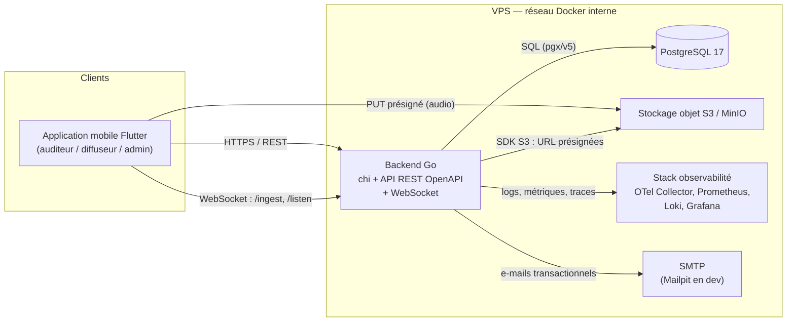
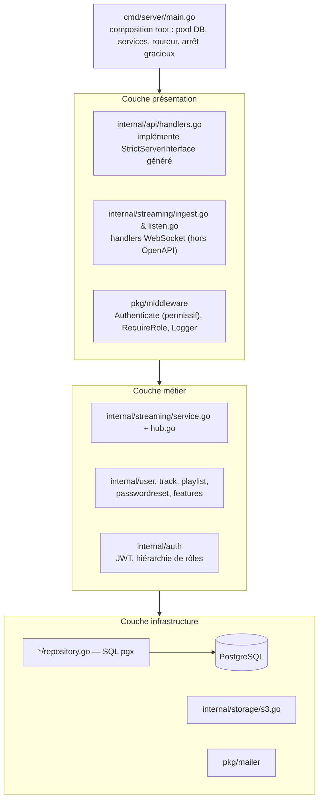

# Architecture — Lyo / StreamPulse

> **Langue :** français. **Language:** French (English summary at the end of each document).
> Tous les diagrammes sont écrits en **Mermaid**, versionnés en texte dans Git, et **chaque diagramme est
> accompagné d'une description textuelle équivalente** — alternative accessible aux lecteurs d'écran.

## Index

| Document | Contenu | Notation standardisée |
|---|---|---|
| [modele-de-donnees.md](modele-de-donnees.md) | MCD, diagramme de classes, dictionnaire de données | UML (classes) + MCD |
| [diagrammes-de-sequence.md](diagrammes-de-sequence.md) | Authentification, streaming live, upload de piste, réinitialisation de mot de passe | UML (séquence) |
| [processus-bpmn.md](processus-bpmn.md) | « Diffuser un live », « Publier une piste », « Modérer un compte » | BPMN |
| [securite.md](securite.md) | Zones de confiance, flux d'authentification, gestion des secrets, mapping OWASP | Diagramme de flux + tableaux |
| [deploiement.md](deploiement.md) | Topologie VPS, conteneurs, réseaux, chaîne CI/CD | UML (déploiement) |

## Vue d'ensemble (niveau contexte)

**Alternative textuelle.** L'application mobile Flutter est le seul client. Elle parle au backend Go
selon trois canaux : l'API REST (contrat OpenAPI), deux endpoints WebSocket (`/streams/{id}/ingest`
pour le diffuseur, `/streams/{id}/listen` pour l'auditeur), et un accès direct au stockage objet via
des URL présignées — l'audio uploadé ne transite donc jamais par l'API. Le backend, déployé sur un
VPS dans un réseau Docker interne, communique avec PostgreSQL 17 via `pgx/v5`, avec le stockage
S3/MinIO via le SDK AWS, avec un serveur SMTP pour les e-mails transactionnels, et émet ses
signaux d'observabilité vers la stack OpenTelemetry / Prometheus / Loki / Grafana.

## Découpage en couches du backend

**Alternative textuelle.** Le backend est organisé en trois couches. `cmd/server/main.go` est la racine
de composition : il construit le pool de connexions, instancie chaque service, monte le routeur chi et
gère l'arrêt gracieux. La couche présentation regroupe les handlers HTTP générés depuis le contrat
OpenAPI, les deux handlers WebSocket et les middlewares (authentification permissive, contrôle de rôle,
journalisation). La couche métier contient le service de streaming et son Hub de diffusion, les services
fonctionnels (utilisateurs, pistes, playlists, réinitialisation de mot de passe, feature flags) et le
service d'authentification JWT. La couche infrastructure regroupe les repositories SQL (pgx), le client
S3, le client SMTP et la base PostgreSQL. Les dépendances vont strictement de haut en bas : aucune
couche basse ne connaît une couche haute.

---

## English summary

Lyo is a real-time audio streaming platform. A single Flutter mobile client talks to a Go backend over
three channels: an OpenAPI-described REST API, two WebSocket endpoints (broadcaster ingest and listener
fan-out), and direct S3 uploads through presigned URLs so that audio bytes never transit through the API.
The backend follows a strict three-layer architecture (presentation / domain / infrastructure) and runs
on a single VPS inside a private Docker network alongside PostgreSQL, MinIO, and the observability stack.
Every diagram in this folder is written in Mermaid and paired with a plain-text equivalent for screen
reader accessibility.
