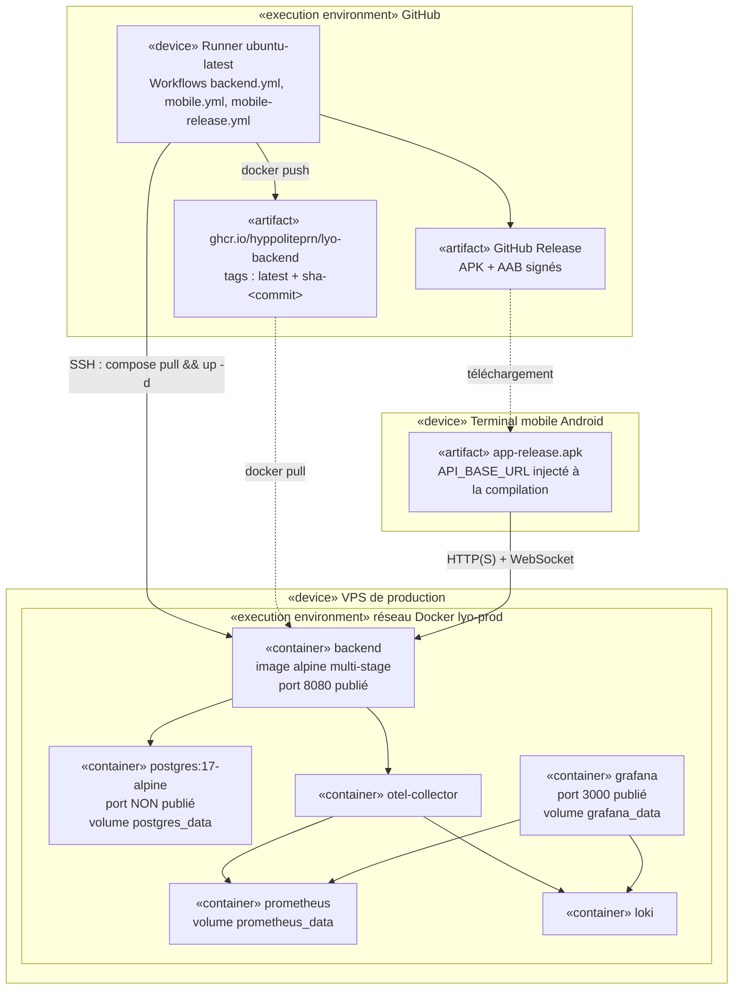
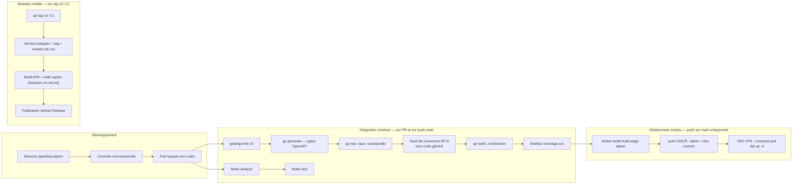

# Diagramme de déploiement et chaîne CI/CD

## 1. Topologie de déploiement (UML — diagramme de déploiement)

**Alternative textuelle.** Trois environnements physiques interviennent. Le terminal Android exécute
l'APK, dont l'URL d'API est figée à la compilation. GitHub héberge les runners de CI/CD, le registre
d'images GHCR — chaque image y est publiée sous deux tags, `latest` et `sha-<commit>`, ce dernier rendant
tout retour arrière trivial — et les Releases contenant les binaires mobiles signés. Le VPS de production
exécute six conteneurs sur un réseau Docker nommé `lyo-prod` : le backend (seul port applicatif publié,
8080), PostgreSQL dont le port n'est **pas** publié vers l'hôte et dont les données sont persistées sur
un volume, le collecteur OpenTelemetry, Prometheus, Loki, et Grafana exposé sur le port 3000. Le runner
pousse l'image puis se connecte en SSH au VPS pour déclencher le rafraîchissement des conteneurs.

### Différences dev / production

| Aspect | `docker/docker-compose.yml` (dev) | `docker/docker-compose.prod.yml` |
|---|---|---|
| Backend | Construit localement | Image tirée depuis GHCR |
| PostgreSQL | Port publié pour l'outillage | **Port non publié** |
| pgAdmin | Présent (confort de développement) | **Absent** |
| Mailpit | Présent (capture des e-mails) | Absent — SMTP réel |
| MinIO + `minio-init` | Présents (S3 local) | Absent — service S3 externe |
| Redémarrage | Par défaut | `restart: unless-stopped` partout |

## 2. Chaîne CI/CD

**Alternative textuelle.** Le travail se fait sur des branches nommées `type/description` avec des
commits conventionnels, puis une pull request vers `main`. L'intégration continue enchaîne, pour le
backend : analyse statique golangci-lint v2, régénération des types depuis le contrat OpenAPI (ce qui
détecte toute dérive entre le contrat et le code), tests avec détecteur de compétition activé et mesure
de couverture, **échec du build si la couverture descend sous 80 %** hors code généré, compilation, puis
archivage du rapport de couverture ; pour le mobile : analyse statique et tests. Le déploiement continu
ne s'exécute que sur `main` : construction d'une image Docker multi-étapes basée sur alpine, publication
sur GHCR sous deux tags, puis connexion SSH au VPS pour tirer et relancer les conteneurs. Les livrables
mobiles sont produits par un pipeline distinct déclenché par un tag de version, qui signe l'APK et l'AAB
et publie une Release GitHub.

### Stratégie de retour arrière

| Situation | Action |
|---|---|
| Régression fonctionnelle localisée | **Basculer le feature flag concerné** — effet immédiat, sans redéploiement, sans redémarrage |
| Version défectueuse | Redéployer l'image `sha-<commit précédent>` déjà présente sur GHCR |
| Migration de base problématique | Chaque migration possède son fichier `down` ; retour arrière possible via golang-migrate |
| Détection | 🚧 Smoke test post-déploiement sur `/health` et rollback automatique — voir la feuille de route |

## 3. Environnements

| Environnement | Existant | Déclencheur | Usage |
|---|---|---|---|
| Local | ✅ | `docker compose up -d` + `go run` | Développement, stack complète y compris S3 et SMTP simulés |
| Intégration (CI) | ✅ | Chaque PR | Vérification lint / tests / build |
| Production | ✅ | Fusion sur `main` | VPS |
| Pré-production (staging) | 🚧 | Prévu sur branche d'intégration | Validation avant production — voir la feuille de route |

---

## English summary

A UML deployment view of the three physical environments (Android device, GitHub runners plus GHCR
registry, and the production VPS running six containers on a private Docker network where PostgreSQL
publishes no host port), followed by the CI/CD pipeline: lint, OpenAPI type regeneration, race-enabled
tests with an 80 % coverage gate excluding generated code, build, image publication under both `latest`
and `sha-<commit>` tags, and SSH-triggered rollout. Rollback is layered: a feature flag toggle for a
scoped regression, a redeploy of the previous SHA-tagged image for a bad release, and reversible
migrations for schema changes. Post-deploy smoke testing and a staging environment are on the roadmap.
