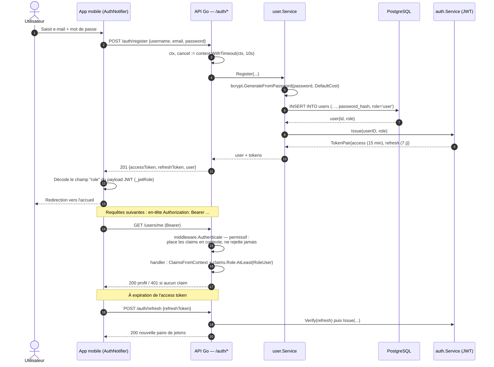
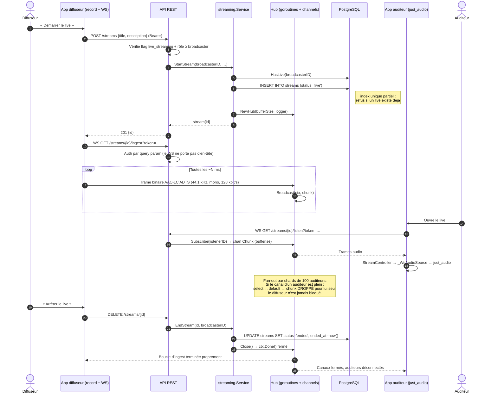
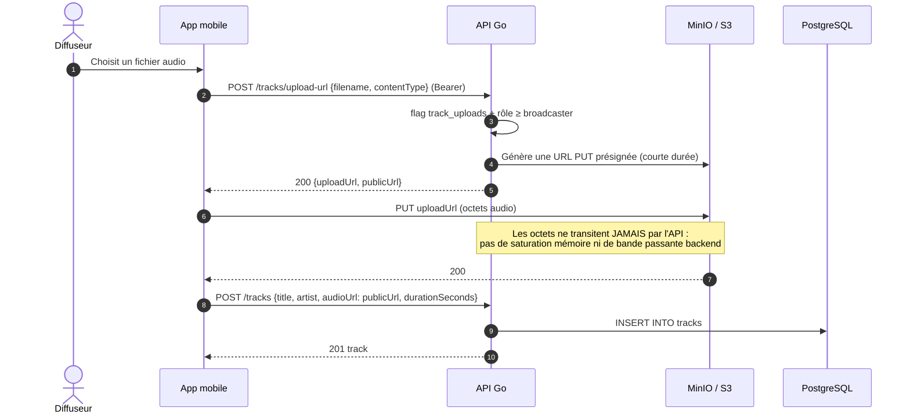
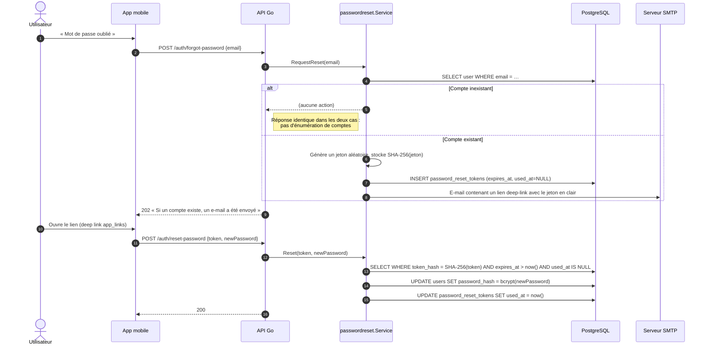

# Diagrammes de séquence (UML)

## 1. Inscription et authentification

**Alternative textuelle.** L'utilisateur saisit ses identifiants dans l'application. Le client appelle
`POST /auth/register`. Le handler dérive d'abord un contexte à échéance de 10 secondes, puis délègue au
service utilisateur qui hache le mot de passe avec bcrypt et insère la ligne avec le rôle `user` par
défaut. Le service JWT émet une paire de jetons : un jeton d'accès valable 15 minutes et un jeton de
rafraîchissement valable 7 jours. Le client décode localement le champ `role` du payload pour adapter
son interface, sans jamais faire confiance à cette valeur pour l'autorisation — celle-ci est toujours
revérifiée côté serveur. Les requêtes suivantes portent l'en-tête `Authorization: Bearer`. Le middleware
d'authentification est volontairement permissif : il enrichit le contexte quand un jeton valide est
présent, mais ne rejette jamais lui-même ; c'est chaque handler qui exige le rôle nécessaire. À
expiration, le client échange son jeton de rafraîchissement contre une nouvelle paire.

## 2. Diffusion live de bout en bout — le cœur du système

**Alternative textuelle.** Le diffuseur demande la création d'un live par l'API REST. Le handler vérifie
successivement que le feature flag `live_streaming` est actif et que l'appelant a au moins le rôle
`broadcaster`, puis le service crée l'enregistrement en base — la base refusant un second live simultané
via un index unique partiel — et instancie un Hub en mémoire. Le diffuseur ouvre alors une connexion
WebSocket d'ingestion, authentifiée par paramètre de requête puisqu'un handshake WebSocket ne transporte
pas d'en-tête personnalisé, et y pousse des trames AAC-LC brutes capturées par le micro. Chaque trame est
diffusée par le Hub. Un auditeur ouvre de son côté une connexion d'écoute ; le Hub lui alloue un canal
bufferisé et l'ajoute à sa table d'abonnés. La diffusion s'effectue en parallèle par lots de 100
auditeurs, une goroutine par lot ; si le canal d'un auditeur est saturé, la trame est abandonnée pour
**cet auditeur seul**, jamais pour les autres, et le diffuseur n'est jamais ralenti : c'est un
back-pressure assumé. À l'arrêt, le service marque le live comme terminé en base et ferme le contexte du
Hub, ce qui termine proprement la boucle d'ingestion et déconnecte tous les auditeurs.

## 3. Publication d'une piste enregistrée (upload S3 présigné)

**Alternative textuelle.** Pour publier une piste, l'application demande d'abord à l'API une URL
d'upload présignée à durée de vie courte. Le fichier est ensuite envoyé **directement** au stockage objet
par le téléphone : les octets audio ne traversent jamais le backend, qui ne porte donc ni la charge
mémoire ni la bande passante de l'upload. Une fois le transfert terminé, le client enregistre les
métadonnées de la piste via un second appel REST.

## 4. Réinitialisation du mot de passe

**Alternative textuelle.** La demande de réinitialisation répond toujours de la même façon, que le compte
existe ou non, afin de ne pas permettre l'énumération d'adresses e-mail. Quand le compte existe, un jeton
aléatoire est généré ; seule son empreinte est conservée en base, le jeton en clair n'existant que dans
l'e-mail envoyé. Le lien ouvre l'application par deep link. La validation exige simultanément une
empreinte correspondante, une date d'expiration non dépassée et un jeton non encore consommé ; l'usage
est unique.

---

## English summary

Four UML sequence diagrams: (1) registration/login with bcrypt hashing, a 15-minute access token and a
7-day refresh token, and a deliberately permissive auth middleware whose role checks live in the
handlers; (2) the end-to-end live pipeline, from broadcaster ingest WebSocket through the in-memory Hub
to listener fan-out, including the non-blocking drop policy that degrades one slow listener rather than
the whole broadcast; (3) presigned-S3 track upload, where audio bytes bypass the API entirely; (4)
password reset with hashed, expiring, single-use tokens and an anti-enumeration constant response.
