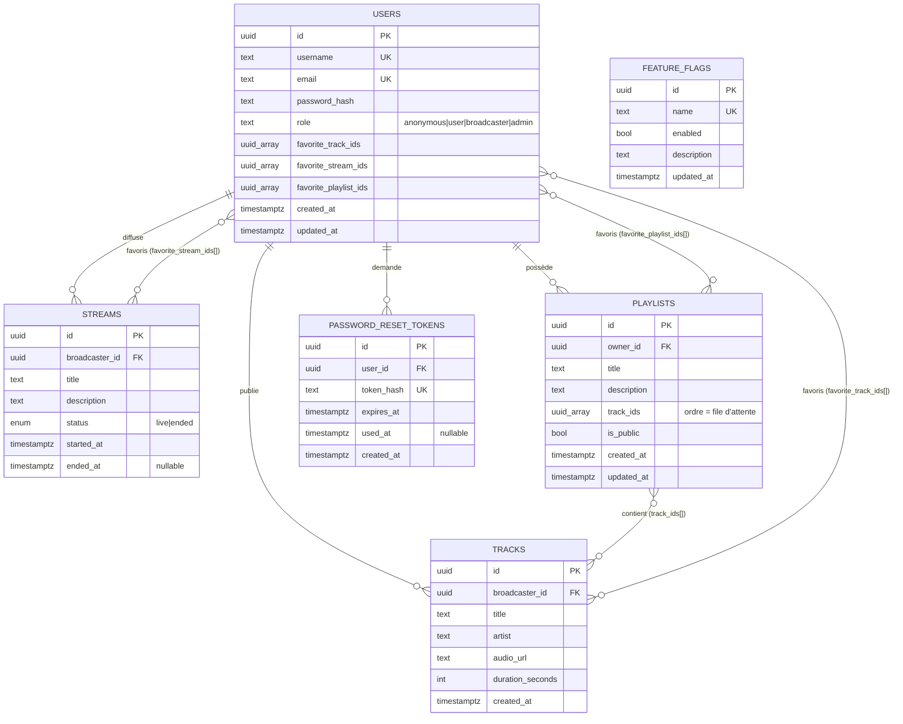

# Modèle de données

Source de vérité : les 9 migrations de `backend/migrations/`, appliquées automatiquement au démarrage
(golang-migrate + `embed.FS`). Chaque migration possède son pendant `down`.

## 1. Diagramme de classes UML / MCD

**Alternative textuelle.** Le modèle comporte six tables. `users` est l'entité centrale : un utilisateur
possède un identifiant UUID, un nom d'utilisateur et un e-mail uniques, un mot de passe haché, un rôle
contraint à quatre valeurs, et trois tableaux d'UUID matérialisant ses favoris (pistes, lives, playlists).
Un utilisateur diffuse zéro à plusieurs `streams`, publie zéro à plusieurs `tracks`, possède zéro à
plusieurs `playlists` et peut avoir plusieurs `password_reset_tokens`. Un `stream` appartient à un seul
diffuseur et porte un statut `live` ou `ended`. Une `playlist` référence ses pistes par un tableau
ordonné `track_ids`, cet ordre constituant la file d'attente de lecture. `feature_flags` est une table
autonome, sans relation, lue au démarrage et interrogeable à chaud. Toutes les clés étrangères vers
`users` sont en `ON DELETE CASCADE`, ce qui garantit l'effacement complet des données d'un compte
supprimé (voir la conformité RGPD).

## 2. Dictionnaire de données

### `users`

| Colonne | Type | Contraintes | Rôle métier | Donnée personnelle (RGPD) |
|---|---|---|---|---|
| `id` | UUID | PK, `gen_random_uuid()` | Identifiant technique stable | Pseudonymisant |
| `username` | TEXT | NOT NULL, UNIQUE, index | Nom affiché publiquement | Oui (pseudonyme) |
| `email` | TEXT | NOT NULL, UNIQUE, index | Identifiant de connexion, canal de réinitialisation | **Oui — donnée directement identifiante** |
| `password_hash` | TEXT | NOT NULL | Empreinte bcrypt (`DefaultCost`) — le mot de passe en clair n'est jamais stocké | Oui (secret) |
| `role` | TEXT | CHECK sur 4 valeurs, défaut `user` | Niveau d'habilitation | Non |
| `favorite_*_ids` | UUID[] | NOT NULL, défaut `{}` | Favoris, dénormalisés pour une lecture en une requête | Oui (préférences) |
| `created_at` / `updated_at` | TIMESTAMPTZ | NOT NULL, défaut `now()` | Audit | Non |

### `streams`

| Colonne | Type | Contraintes | Rôle métier |
|---|---|---|---|
| `id` | UUID | PK | Identifiant du live, utilisé dans les URL WebSocket |
| `broadcaster_id` | UUID | FK → `users(id)` ON DELETE CASCADE, index | Propriétaire du live |
| `status` | ENUM `stream_status` | `live` \| `ended`, index | État du cycle de vie |
| `started_at` / `ended_at` | TIMESTAMPTZ | `ended_at` nullable | Durée de diffusion |

> **Contrainte métier notable :** l'index unique partiel
> `uidx_streams_broadcaster_live ON streams (broadcaster_id) WHERE status = 'live'`
> (migration 000006) interdit à un diffuseur d'avoir deux lives simultanés. Cette règle est portée par
> la **base** et non par le code applicatif, ce qui élimine la fenêtre de concurrence (TOCTOU) entre la
> vérification `HasLive()` et l'insertion `Create()` dans le service.

### `tracks`

| Colonne | Type | Rôle métier |
|---|---|---|
| `audio_url` | TEXT | URL publique de l'objet S3 ; le fichier lui-même n'est jamais en base |
| `duration_seconds` | INT | Durée, alimentée par le client à la création |

### `playlists`

| Colonne | Type | Rôle métier |
|---|---|---|
| `track_ids` | UUID[] | **Ordonné** — l'ordre du tableau *est* la file d'attente (queue) de lecture |
| `is_public` | BOOLEAN | Ajouté par la migration 000008 ; défaut `false` (privé par défaut, principe de minimisation) |

### `password_reset_tokens`

| Colonne | Type | Rôle métier |
|---|---|---|
| `token_hash` | TEXT, UNIQUE | Seule l'**empreinte** du jeton est stockée ; le jeton en clair n'existe que dans l'e-mail |
| `expires_at` | TIMESTAMPTZ | Durée de vie courte |
| `used_at` | TIMESTAMPTZ | Usage unique : un jeton consommé n'est plus rejouable |

### `feature_flags`

| Colonne | Type | Rôle métier |
|---|---|---|
| `name` | TEXT, UNIQUE | Clé du flag (`live_streaming`, `chat_websocket`, …) |
| `enabled` | BOOLEAN | Activation à chaud, sans redéploiement |

## 3. Choix de modélisation à défendre

| Choix | Alternative écartée | Justification |
|---|---|---|
| Favoris et contenu de playlist en `UUID[]` | Tables de jointure `user_favorites`, `playlist_tracks` | Lecture d'une playlist ou du profil en **une seule requête**, sans jointure ; l'ordre du tableau porte gratuitement la sémantique de file d'attente. Limite assumée : pas d'intégrité référentielle sur les éléments du tableau, et la volumétrie doit rester modeste (quelques centaines d'éléments). Une table de jointure deviendra nécessaire si l'on veut indexer les favoris par piste (« qui a aimé cette piste ? »). |
| `ENUM` PostgreSQL pour `stream_status` | TEXT + CHECK | Validation portée par le SGBD, taille de stockage réduite |
| Index unique partiel pour « un seul live » | Verrou applicatif | Règle métier inviolable même en cas d'instances multiples du backend |
| Soft-end des streams (`status='ended'`) | `DELETE` | Conserve l'historique de diffusion pour les statistiques et les favoris |
| `ON DELETE CASCADE` partout | `RESTRICT` | Rend le droit à l'effacement RGPD atteignable en une seule opération |

---

## English summary

The schema has six tables. `users` is the aggregate root, holding credentials (bcrypt hash only), an
ordinal role, and three UUID arrays denormalising favourites. `streams` and `tracks` belong to a
broadcaster; `playlists` belong to an owner and store their tracks as an **ordered** UUID array, which
doubles as the playback queue. A partial unique index enforces at database level that a broadcaster
cannot run two live streams at once, removing a TOCTOU race from the service layer. Password reset
tokens are stored hashed, expire, and are single-use. All foreign keys cascade on delete, which makes
GDPR erasure a single operation.
