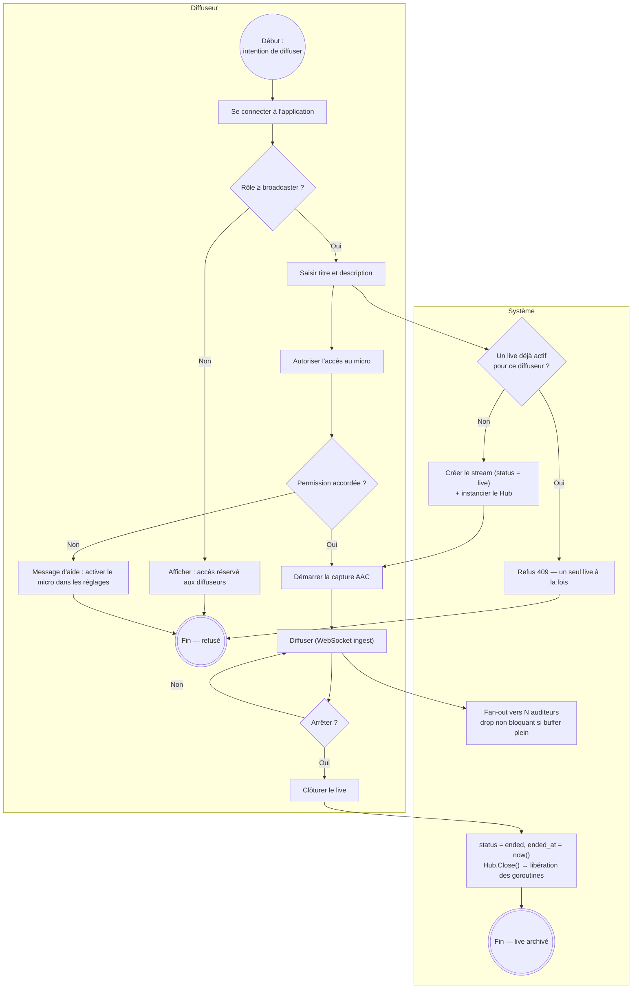
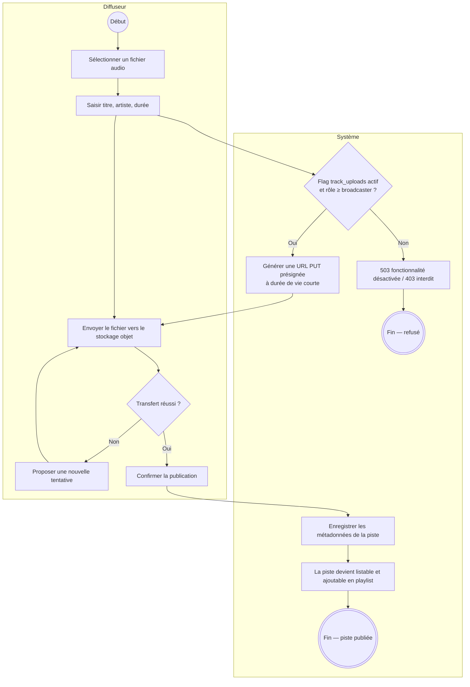
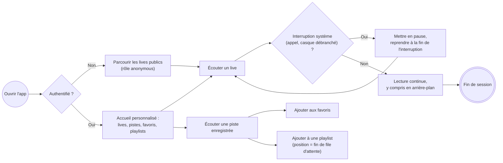
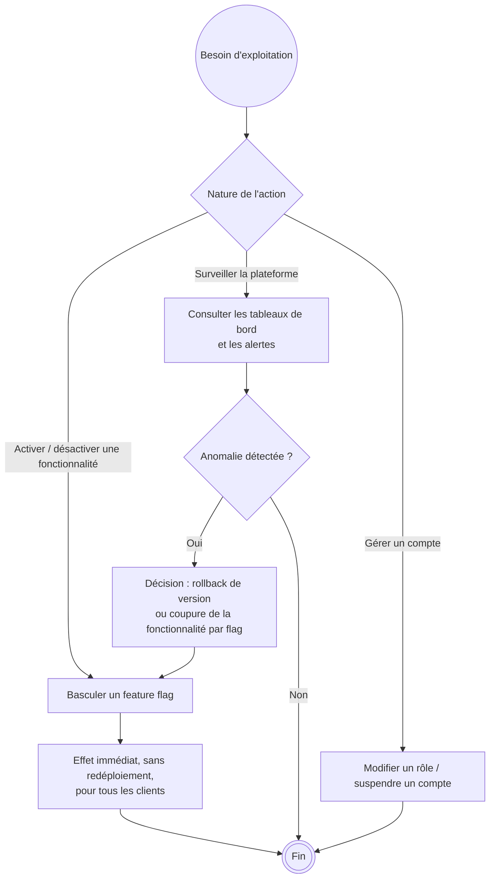

# Processus métier (BPMN)

Les processus ci-dessous sont modélisés en BPMN simplifié (couloirs, événements, tâches, passerelles).
Chaque diagramme est suivi de son équivalent textuel.

## 1. Diffuser un live

**Alternative textuelle.** Le processus débute par l'intention de diffuser. Le système vérifie d'abord
l'habilitation : un utilisateur sans le rôle `broadcaster` est refusé. Le diffuseur saisit ensuite le
titre et la description du live ; le système contrôle qu'aucun live n'est déjà actif pour ce compte et
refuse sinon. La permission d'accès au micro est demandée à l'OS ; en cas de refus, un message d'aide
oriente vers les réglages. La capture audio démarre alors et la diffusion s'effectue en continu par
WebSocket, le système opérant le fan-out vers tous les auditeurs avec abandon non bloquant des trames
pour les auditeurs saturés. À la demande d'arrêt, le live est marqué terminé, horodaté, et les
ressources du Hub sont libérées.

## 2. Publier une piste enregistrée

**Alternative textuelle.** Le diffuseur sélectionne un fichier et renseigne les métadonnées. Le système
vérifie le feature flag et le rôle, puis délivre une URL d'upload présignée à durée de vie courte. Le
téléphone envoie le fichier directement au stockage objet, avec possibilité de nouvelle tentative en cas
d'échec réseau. Une fois le transfert confirmé, les métadonnées sont enregistrées et la piste devient
listable publiquement et ajoutable à une playlist.

## 3. Écouter et organiser (parcours auditeur)

**Alternative textuelle.** À l'ouverture, un visiteur non authentifié peut parcourir et écouter les lives
publics avec le rôle `anonymous` ; un utilisateur authentifié obtient en plus un accueil personnalisé
avec ses favoris et playlists. Pendant l'écoute, les interruptions système (appel entrant, débranchement
du casque) déclenchent une pause puis une reprise. La lecture se poursuit en arrière-plan. Une piste
peut être mise en favori ou ajoutée en fin de file d'attente d'une playlist.

## 4. Administrer (rôle admin)

**Alternative textuelle.** L'administrateur dispose de trois familles d'actions. Il peut basculer un
feature flag, avec effet immédiat sur tous les clients et sans redéploiement — c'est aussi le mécanisme
de coupure d'urgence d'une fonctionnalité défaillante. Il peut surveiller la plateforme via les tableaux
de bord et les alertes, et déclencher soit un retour à la version précédente, soit une coupure
fonctionnelle par flag. Il peut enfin gérer les comptes (changement de rôle, suspension).

> **État d'implémentation.** Le basculement de flag et la gestion de comptes sont décrits au contrat
> OpenAPI (`/admin/features`, `/admin/features/{name}/toggle`) ; leur implémentation et l'écran
> d'administration mobile figurent à la feuille de route (voir `docs/cahier-des-charges.fr.md`, § Feuille
> de route). Ce document décrit le processus cible, pas un existant.

---

## English summary

Four BPMN-style process models with swimlanes: going live (role check, single-live constraint,
microphone permission, non-blocking fan-out, graceful teardown), publishing a recorded track (feature
flag gate, presigned upload, metadata registration), the listener journey (anonymous browsing, audio
interruption handling, favourites and playlist queueing), and the admin loop (feature-flag kill switch,
dashboard-driven incident decision, account management). The admin lane describes the target process;
its implementation status is tracked in the roadmap.
