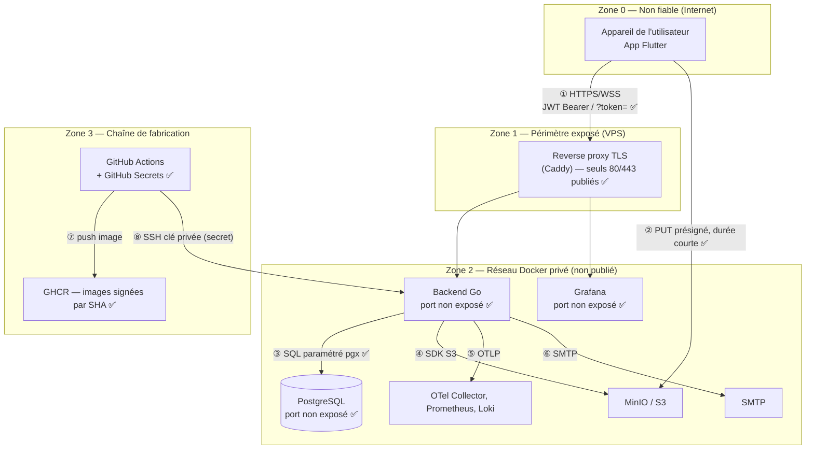
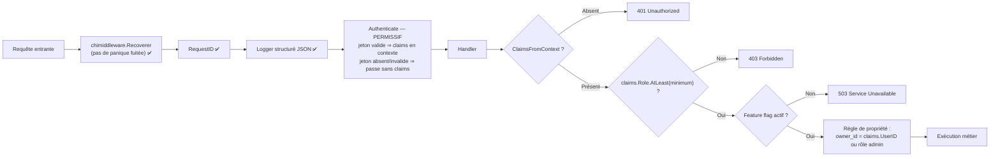

# Schéma général de la sécurité

> **Convention de lecture.** ✅ = implémenté et vérifiable dans le dépôt · 🚧 = planifié, voir la feuille
> de route du cahier des charges. Ce document décrit l'état réel du système ; aucun contrôle n'y est
> présenté comme acquis s'il ne l'est pas.

## 1. Zones de confiance et flux

**Alternative textuelle.** Le système comporte quatre zones. La zone 0 (Internet, non fiable) contient
l'appareil de l'utilisateur : aucune donnée qui en provient n'est considérée comme sûre. La zone 1 est le
périmètre exposé du VPS, et il ne contient plus qu'un seul conteneur : le reverse proxy Caddy, qui
termine TLS, redirige le port 80 vers HTTPS et est le **seul** à publier des ports. La zone 2 est le
réseau Docker privé : le backend, Grafana, PostgreSQL, le stockage objet, la collecte d'observabilité et
le SMTP n'y publient aucun port vers l'hôte en production et ne sont joignables qu'à travers le proxy —
il n'existe donc aucun chemin en clair vers la plateforme. La zone 3 est la chaîne de fabrication :
GitHub Actions, qui détient les secrets de déploiement, et le registre GHCR où chaque image est taguée
par le SHA du commit. Huit flux relient ces zones, détaillés dans le tableau suivant.

| # | Flux | Authentification | Chiffrement | Statut |
|---|---|---|---|---|
| ① | Mobile → API (REST + WebSocket) | JWT `Bearer` ; pour le WebSocket, repli sur `?token=` car un handshake WS ne porte pas d'en-tête personnalisé | TLS terminé par Caddy (certificats ACME renouvelés automatiquement), HTTP redirigé vers HTTPS, `wss://` pour les WebSockets | ✅ |
| ② | Mobile → S3 | URL présignée, durée de vie courte, portée à un objet | HTTPS si `S3_PUBLIC_ENDPOINT` est en HTTPS | ✅ |
| ③ | API → PostgreSQL | Identifiants en variable d'environnement | Réseau Docker privé | ✅ |
| ④ | API → S3 | Clés d'accès en variable d'environnement | — | ✅ |
| ⑤ | API → observabilité | Réseau interne | — | ✅ infra / 🚧 émission applicative |
| ⑥ | API → SMTP | Identifiants SMTP | STARTTLS selon le fournisseur | ✅ |
| ⑦ | CI → GHCR | `GITHUB_TOKEN` à portée réduite (`packages: write`) | HTTPS | ✅ |
| ⑧ | CI → VPS | Clé SSH privée stockée en GitHub Secret | SSH | ✅ |

## 2. Chaîne d'authentification et d'autorisation

**Alternative textuelle.** Toute requête traverse une chaîne de middlewares : récupération des paniques,
identifiant de corrélation, journalisation structurée, puis authentification. L'authentification est
délibérément **permissive** : si un jeton valide est présent, les claims sont placés dans le contexte ;
sinon la requête poursuit sans claims. Ce choix, documenté en ADR, permet aux endpoints publics de servir
les visiteurs anonymes sans dupliquer les routes. C'est le handler qui décide : absence de claims donne
401, rôle insuffisant donne 403, fonctionnalité désactivée donne 503, et enfin la règle de propriété
(l'appelant est propriétaire de la ressource, ou administrateur) est vérifiée avant l'exécution métier.

**Hiérarchie de rôles ordinale** (`internal/auth/roles.go`) : `anonymous` (0) < `user` (1) <
`broadcaster` (2) < `admin` (3). Un contrôle s'écrit toujours `claims.Role.AtLeast(auth.RoleBroadcaster)`,
jamais par égalité — ce qui évite la classe de bug « l'admin n'a pas accès à une route broadcaster ».

## 3. Gestion des secrets

| Secret | Emplacement | Jamais dans le dépôt |
|---|---|---|
| `JWT_SECRET` (≥ 32 caractères) | Variable d'environnement, `.env` du VPS | ✅ `.env` en `.gitignore` |
| `DATABASE_URL`, `POSTGRES_PASSWORD` | Variable d'environnement | ✅ |
| `S3_ACCESS_KEY_ID` / `S3_SECRET_ACCESS_KEY` | Variable d'environnement | ✅ |
| `SMTP_USER` / `SMTP_PASS` | Variable d'environnement | ✅ |
| `GRAFANA_PASSWORD` | Variable d'environnement | ✅ |
| Clé SSH de déploiement, keystore Android | GitHub Secrets (chiffrés au repos, masqués dans les logs) | ✅ |

`pkg/config/config.go` centralise toute la configuration ; `requireEnv` échoue au démarrage si une
variable critique manque — un déploiement mal configuré ne démarre pas silencieusement en mode dégradé.
`.env.example` documente l'ensemble des variables sans jamais contenir de valeur réelle.

## 4. Mesures de sécurité applicative

| Mesure | Détail | Statut |
|---|---|---|
| Hachage des mots de passe | `bcrypt` avec `DefaultCost`, jamais de mot de passe en clair, ni en base ni en log | ✅ |
| Jetons JWT | HMAC ; l'algorithme est **vérifié explicitement** à la validation (`SigningMethodHMAC`), ce qui bloque l'attaque `alg: none` | ✅ |
| Durée de vie des jetons | Accès 15 min, rafraîchissement 7 j, configurables | ✅ |
| Jetons de réinitialisation | Stockés hachés, expirants, à usage unique (`used_at`) | ✅ |
| Anti-énumération de comptes | `POST /auth/forgot-password` répond identiquement que le compte existe ou non | ✅ |
| Injection SQL | Requêtes **exclusivement paramétrées** via `pgx` ; aucune concaténation de chaîne SQL | ✅ |
| Cloisonnement des données | Toute lecture/écriture d'une ressource possédée filtre sur `owner_id` / `broadcaster_id` | ✅ |
| Timeouts | `context.WithTimeout` en tête de handler ; 503 sur `DeadlineExceeded` | ✅ (29/36 handlers) |
| Déni de service par auditeur lent | Buffer borné par auditeur + abandon de trame, jamais de blocage du diffuseur | ✅ |
| Un seul live par diffuseur | Index unique partiel en base | ✅ |
| Gestion des paniques | `chimiddleware.Recoverer` — aucune stack trace renvoyée au client | ✅ |
| CORS | Origines configurées par `CORS_ALLOWED_ORIGINS` ; par défaut, origines locales uniquement | ✅ |
| Chiffrement en transit | TLS / `wss://` terminé par Caddy ; certificats ACME automatiques ([ADR 012](../adr/012-tls-reverse-proxy.md)) | ✅ |
| En-têtes de sécurité | HSTS, `X-Content-Type-Options`, `X-Frame-Options`, `Referrer-Policy`, `Permissions-Policy`, `Server` supprimé — posés au niveau du proxy pour **toutes** les routes, y compris celles hors contrat OpenAPI | ✅ |
| Élévation de privilège | Aucune surface HTTP n'écrit un rôle : l'inscription crée toujours un `user`, `PATCH /users/me` ne touche que `username`/`email`, et le rafraîchissement de jeton relit le rôle en base au lieu de le recopier depuis le jeton présenté — un compte rétrogradé ou supprimé ne peut plus renouveler ses anciens privilèges | ✅ |
| Confiance dans `X-Forwarded-For` | Accordée uniquement si `TRUSTED_PROXY=true` ; sur une socket exposée directement, l'en-tête est contrôlé par l'appelant | ✅ |
| Longueur du secret JWT | `JWT_SECRET` de moins de 32 caractères refusé au démarrage | ✅ |
| Limitation de débit | `/auth/login`, `/auth/register`, `/auth/forgot-password` | 🚧 |
| Analyse de vulnérabilités en CI | `govulncheck`, `gosec`, scan d'image, Dependabot | 🚧 |

## 5. Correspondance OWASP Top 10 (2021)

| Risque OWASP | Traitement dans Lyo | Statut |
|---|---|---|
| **A01** Contrôle d'accès défaillant | Hiérarchie de rôles ordinale + vérification de propriété dans chaque handler ; aucune route n'écrit un rôle et le rôle est relu en base à chaque rafraîchissement ; tests de non-régression dédiés (`internal/api/privilege_escalation_test.go`) | ✅ |
| **A02** Défaillance cryptographique | bcrypt pour les mots de passe, SHA-256 pour les jetons de reset, HMAC pour les JWT (clé de 32 caractères minimum imposée au démarrage), TLS en transit | ✅ |
| **A03** Injection | Requêtes paramétrées pgx uniquement | ✅ |
| **A04** Conception non sécurisée | Contrainte « un seul live » portée par la base ; back-pressure borné ; feature flags comme coupe-circuit | ✅ |
| **A05** Mauvaise configuration | Configuration 100 % par variables d'environnement, échec au démarrage si secret manquant, Postgres non exposé en production | ✅ |
| **A06** Composants vulnérables | Versions d'images épinglées ; **analyse automatisée des dépendances absente** | 🚧 |
| **A07** Défaillance d'identification | JWT vérifié (algorithme inclus), jetons de reset à usage unique, anti-énumération ; **limitation de débit absente** | 🚧 |
| **A08** Intégrité logicielle | Images taguées par SHA de commit, CI obligatoire avant fusion ; signature des commits à généraliser | 🚧 partiel |
| **A09** Journalisation insuffisante | Logs structurés JSON avec identifiant de requête ; **corrélation traces/logs et alertes à finaliser** | 🚧 partiel |
| **A10** SSRF | Aucune URL fournie par l'utilisateur n'est appelée côté serveur | ✅ sans objet |

## 6. Recommandations ANSSI appliquées

| Recommandation | Application concrète |
|---|---|
| Secrets hors du code source | Variables d'environnement, GitHub Secrets, `.gitignore` vérifié ✅ |
| Moindre privilège | Rôles ordinaux ; `GITHUB_TOKEN` limité à `packages: write` ; Postgres non publié ✅ |
| Cloisonnement réseau | Réseau Docker privé ; en production seul le reverse proxy publie des ports (80/443), et `/internal/*` est refusé au niveau du proxy ✅ |
| Journalisation des événements | Logs structurés horodatés avec identifiant de corrélation ✅ |
| Maintien en condition de sécurité | Versions épinglées ; automatisation des mises à jour à mettre en place 🚧 |
| Sauvegarde | Volume `postgres_data` persistant ; politique de sauvegarde à formaliser 🚧 |

---

## English summary

The security model defines four trust zones (untrusted client, exposed VPS perimeter, private Docker
network, build chain) and eight inter-zone flows, each with its authentication and encryption status.
Authorization is a deliberate two-stage design: a permissive middleware that only enriches the request
context, and per-handler role, feature-flag and ownership checks, built on an ordinal role hierarchy
(`AtLeast`) that structurally prevents "admin lacks a broadcaster route" bugs. Implemented controls
include bcrypt hashing, explicit JWT algorithm verification (blocking `alg: none`), hashed single-use
expiring reset tokens, account-enumeration resistance, exclusively parameterised SQL, bounded per-listener
buffers, and environment-only secrets with fail-fast startup. Transport is encrypted end to end: Caddy
terminates TLS with automatically renewed ACME certificates and is the only container publishing a port,
so the API, Grafana and PostgreSQL have no plaintext entry point. No HTTP surface writes a role, and token
refresh re-reads it from the database, so privileges cannot outlive their removal. Known gaps, tracked in
the roadmap, are rate limiting on auth endpoints and automated dependency scanning.
